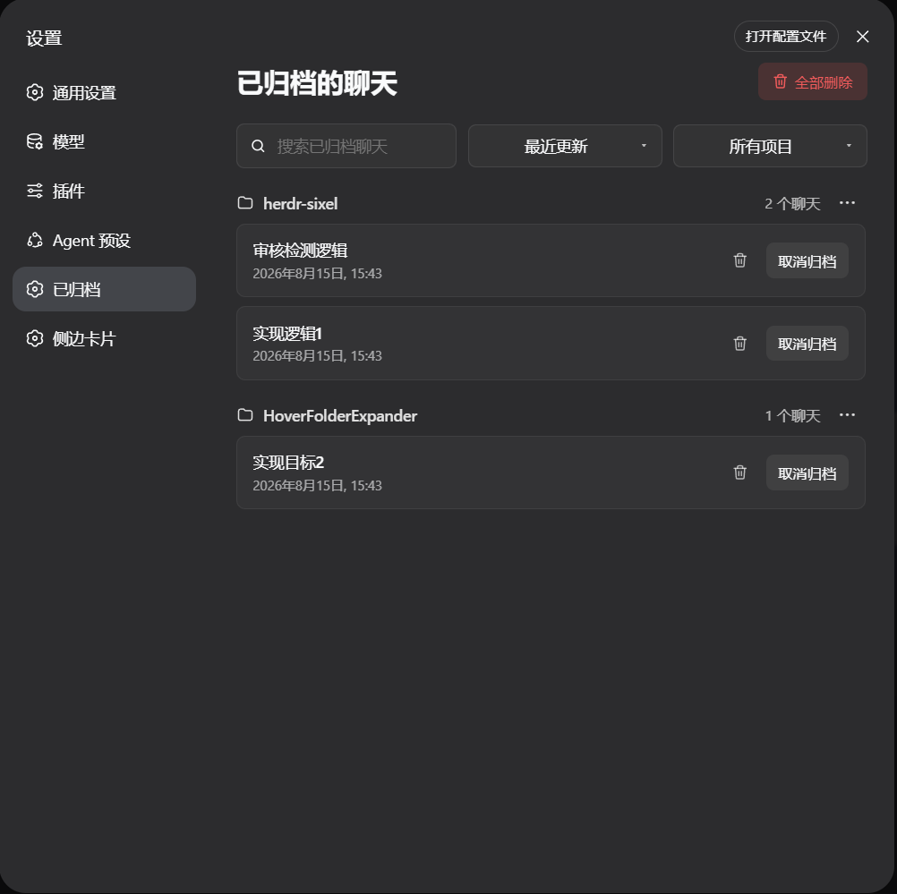
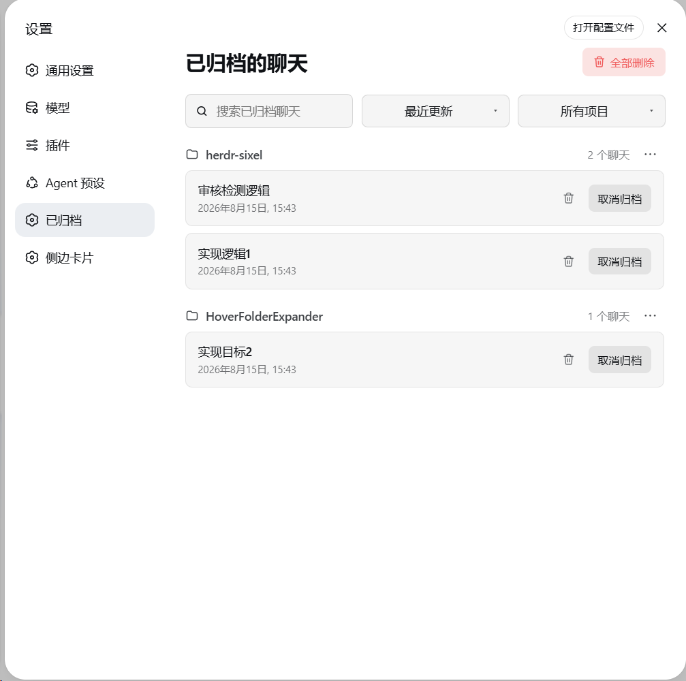

# DSH Better Archive

> 为 [DeepSeek Harness (DSH)](https://github.com/deepseek-ai/deepseek-harness) Web GUI 提供完整、可管理的已归档会话视图。

`dsh-better-archive` 会在 DSH 侧边栏的设置区域新增「已归档」入口。你可以查找和筛选归档会话、恢复会话，或按需永久删除不再需要的归档记录。

## 界面

| 深色模式 | 浅色模式 |
| :---: | :---: |
|  |  |

## 功能

- 在 DSH 设置区提供独立的「已归档」页面。
- 按项目查看归档会话；支持关键词搜索、项目筛选，以及按更新时间或名称排序。
- 一键取消归档。恢复后会话会立即回到 DSH 的正常会话列表。
- 支持删除单个会话、某个项目下的全部归档会话，或清空全部归档会话；仍在使用的会话会在重启 DSH 后自动删除。
- 页面文案跟随 DSH 的语言设置，中英文切换无需刷新页面。

## 安装

需要 Node.js 22.19+ 和 pnpm。

```sh
dsh plugin --profile web add github:huahai0202/dsh-better-archive
```

安装完成后重启 `dsh web`。插件会自动加入该 profile 的 `dsh.profile.bundles`；若未自动加入，请在该数组中添加 `"dsh-better-archive"`，然后重启 DSH Web。

## 更新

通过上述 GitHub 方式安装的插件可使用以下命令更新：

```sh
dsh plugin --profile web update dsh-better-archive
```

更新完成后重启 `dsh web`，使正在运行的 Host 和客户端加载新版本。

## 本地开发

```sh
dsh plugin --profile web add link:<path-to-this-checkout>
```

本地修改后重启 `dsh web`，以加载最新的插件代码。

提交前可运行以下检查：

```sh
node --check lib/index.js
node --check lib/client.js
npm pack --dry-run
```

## 删除行为

永久删除只作用于已归档会话，操作前会要求确认。针对 DSH `0.1.0-rc.7` 的默认 JSONL 会话存储，插件会删除会话专属目录，并同步移除对应的工作区与归档记账。

DSH 的归档操作只会将会话从常规列表中隐藏，并不等于终止会话。删除行为取决于会话当前是否仍由 DSH 进程持有：

| 会话状态 | 点击删除后的行为 | 页面状态 |
| --- | --- | --- |
| 冷会话 | 立即永久删除会话目录，并同步移除工作区和归档记录 | 从已归档列表中移除 |
| 当前仍存活的会话 | 写入待删除标记，下次 DSH 启动时自动完成物理删除 | 保留在列表中并显示「重启后删除」 |

在 DSH 重启前点击「取消归档」，会同时撤销待删除标记，不会在下次启动时删除该会话。

批量删除可以同时处理冷会话和仍存活的会话；若中途失败，接口会报告已立即删除和已安排重启后删除的会话，并刷新页面状态。

DSH 的内容寻址附件由 DSH 独立管理，因此不会随会话记录一起删除。

## 开发接口

| 路由 | 方法 | 用途 |
| --- | --- | --- |
| `/archived/pending` | `GET` | 查询标记为重启后删除的会话 |
| `/archived/unarchive` | `POST` | 取消归档一个会话 |
| `/archived/delete` | `POST` | 立即删除或安排重启后删除一个归档会话 |
| `/archived/delete-project` | `POST` | 删除或安排删除一个项目的全部归档会话 |
| `/archived/delete-all` | `POST` | 删除或安排删除全部归档会话 |

## 目录

```text
dsh-better-archive/
├── lib/
│   ├── index.js        # DSH Host 路由与会话操作
│   └── client.js       # 归档页面与侧边栏入口
├── cordis.patch.yml    # Host 挂载配置
├── package.json        # 插件声明
└── assets/             # README 截图
```

## License

[MIT](./LICENSE)
